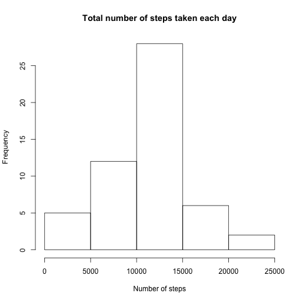
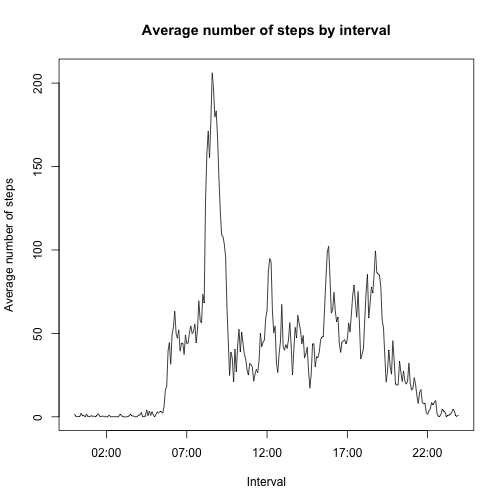
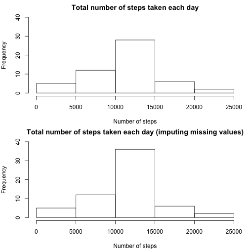
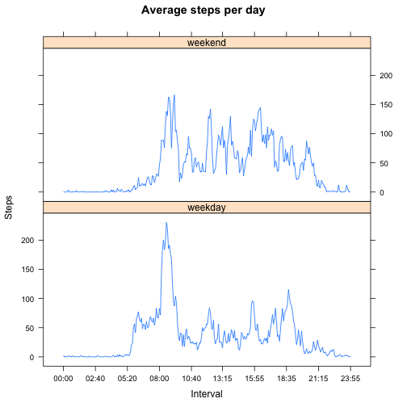

**Introduction**

It is now possible to collect a large amount of data about personal movement using activity monitoring devices such as a Fitbit, Nike Fuelband, or Jawbone Up. These type of devices are part of the ???quantified self??? movement ??? a group of enthusiasts who take measurements about themselves regularly to improve their health, to find patterns in their behavior, or because they are tech geeks. But these data remain under-utilized both because the raw data are hard to obtain and there is a lack of statistical methods and software for processing and interpreting the data.

This assignment makes use of data from a personal activity monitoring device. This device collects data at 5 minute intervals through out the day. The data consists of two months of data from an anonymous individual collected during the months of October and November, 2012 and include the number of steps taken in 5 minute intervals each day.
Data

The data for this assignment can be downloaded from the course web site:  

Dataset: [Activity monitoring data (52K)](https://d396qusza40orc.cloudfront.net/repdata%2Fdata%2Factivity.zip)


The variables included in this dataset are:

- steps: Number of steps taking in a 5-minute interval (missing values are coded as NA)

- date: The date on which the measurement was taken in YYYY-MM-DD format

- interval: Identifier for the 5-minute interval in which measurement was taken

The dataset is stored in a comma-separated-value (CSV) file and there are a total of 17,568 observations in this dataset.

**Loading and preprocessing the data** 

Show any code that is needed to 

1. Load the data (i.e. read.csv())    

```r
if (!require("downloader")) {
    install.packages("downloader")
}
```

```
## Loading required package: downloader
```

```r
library(downloader)

if (!require("lattice")) {
    install.packages("lattice")
}
```

```
## Loading required package: lattice
```

```r
library(lattice)

if (!require("dplyr")) {
    install.packages("dplyr")
}
```

```
## Loading required package: dplyr
## 
## Attaching package: 'dplyr'
## 
## The following object is masked from 'package:stats':
## 
##     filter
## 
## The following objects are masked from 'package:base':
## 
##     intersect, setdiff, setequal, union
```

```r
library("dplyr")

if (!file.exists("data")) {
    dir.create("data") 
}

if (!file.exists("data/activity.csv")) {
    download("https://d396qusza40orc.cloudfront.net/repdata%2Fdata%2Factivity.zip",
             "data/data_activity.zip")
    unzip("data/data_activity.zip", exdir = "data")
}   
```
    
2. Process/transform the data (if necessary) into a format suitable for your analysis     

```r
data <- read.csv("data/activity.csv", stringsAsFactors = FALSE)
data$date <- as.Date(data$date)
data$interval <- sprintf("%02d:%02d", data$interval %/% 100, 
                         data$interval %% 100)
```

**What is mean total number of steps taken per day?** 

For this part of the assignment, you can ignore the missing values in the dataset. 

1. Calculate the total number of steps taken per day 

```r
clean_data <- data[complete.cases(data), ]
steps_total <- clean_data %>% 
    group_by(date) %>%
    summarize(total_steps = sum(steps))
```
    
2. If you do not understand the difference between a histogram and a barplot, research the difference between them. Make a histogram of the total number of steps taken each day 

```r
hist(steps_total$total_steps, 
     main = "Total number of steps taken each day",
     xlab = "Number of steps")
```

 
    
3. Calculate and report the mean and median of the total number of steps taken per day  

```r
steps_summary <- steps_total %>%
    summarize(mean_steps = mean(total_steps),
              median_steps = median(total_steps))
print(steps_summary[c("mean_steps", "median_steps")])
```

```
## Source: local data frame [1 x 2]
## 
##   mean_steps median_steps
## 1   10766.19        10765
```

**What is the average daily activity pattern?**

1. Make a time series plot (i.e. type = "l") of the 5-minute interval (x-axis) and the average number of steps taken, averaged across all days (y-axis) 

```r
# What is the average daily activity pattern?
steps_mean <- clean_data %>%
    group_by(interval) %>%
    summarize(mean_steps = mean(steps))
plot(strptime(steps_mean$interval, "%H:%M"), steps_mean$mean_steps, type = "l",
     main = "Average number of steps by interval", 
     xlab = "Interval", ylab = "Average number of steps")
```

 

2. Which 5-minute interval, on average across all the days in the dataset, contains the maximum number of steps?  

```r
max_steps_index <- which(steps_mean$mean_steps == max(steps_mean$mean_steps))
max_steps <- steps_mean[max_steps_index, ]
print(max_steps)
```

```
## Source: local data frame [1 x 2]
## 
##   interval mean_steps
## 1    08:35   206.1698
```

**Imputing missing values**  

Note that there are a number of days/intervals where there are missing values (coded as NA). The presence of missing days may introduce bias into some calculations or summaries of the data.  

1. Calculate and report the total number of missing values in the dataset (i.e. the total number of rows with NAs) 

```r
print(sum(!complete.cases(data)))
```

```
## [1] 2304
```

2. Devise a strategy for filling in all of the missing values in the dataset. The strategy does not need to be sophisticated. For example, you could use the mean/median for that day, or the mean for that 5-minute interval, etc.

**Strategy**:

- Add column in original data set ("mean_index"), with value of index from the data set with mean for this 5-minute interval  

- For each NA value, get period and find the mean value from the mean data set

- Replace NA value with the value that we found in the mean data set  

3. Create a new dataset that is equal to the original dataset but with the missing data filled in.

```r
impute_data <- data
data$mean_index <- match(data$interval, steps_mean$interval)
impute_data$steps <- ifelse(is.na(data$steps), 
                            steps_mean[data$mean_index, ]$mean_steps, 
                            data$steps)
```

4. Make a histogram of the total number of steps taken each day and Calculate and report the mean and median total number of steps taken per day. Do these values differ from the estimates from the first part of the assignment? What is the impact of imputing missing data on the estimates of the total daily number of steps?  

```r
impute_steps_total <- impute_data %>% 
    group_by(date) %>%
    summarize(total_steps = sum(steps))

par(mfrow = c(2,1), mar = c(4, 4, 2, 1))
hist(steps_total$total_steps, 
     main = "Total number of steps taken each day",
     xlab = "Number of steps", ylim = c(0, 40))
hist(impute_steps_total$total_steps, 
     main = "Total number of steps taken each day (imputing missing values)",
     xlab = "Number of steps", ylim = c(0, 40))
```

 

```r
impute_steps_summary <- impute_steps_total %>%
    summarize(mean_steps = mean(total_steps),
              median_steps = median(total_steps))
print(impute_steps_summary[c("mean_steps", "median_steps")])
```

```
## Source: local data frame [1 x 2]
## 
##   mean_steps median_steps
## 1   10766.19     10766.19
```

**Conclusion**: after imputing missing values in the original data set  

- Median is now equal to mean

- Center bar in new histogram is higher (8 points above of the clean data set, because of 8 days with missing values that we exclude from the clean data set)


**Are there differences in activity patterns between weekdays and weekends?**

1. For this part the weekdays() function may be of some help here. Use the dataset with the filled-in missing values for this part.  

2. Create a new factor variable in the dataset with two levels ??? ???weekday??? and ???weekend??? indicating whether a given date is a weekday or weekend day.  

```r
impute_data$wday <- factor(c("weekday", "weekend"))
impute_data[weekdays(impute_data$date) %in% c("Saturday", "Sunday"), ]$wday <- "weekend"
impute_data[!(weekdays(impute_data$date) %in% c("Saturday", "Sunday")), ]$wday <- "weekday"
```
    
3. Make a panel plot containing a time series plot (i.e. type = "l") of the 5-minute interval (x-axis) and the average number of steps taken, averaged across all weekday days or weekend days (y-axis). See the README file in the GitHub repository to see an example of what this plot should look like using simulated data.  

```r
impute_steps_mean <- aggregate(steps ~ interval + wday, impute_data, mean)
at <- round(seq(1, nrow(impute_steps_mean) / 2, length.out=10))

impute_steps_mean$interval <- as.POSIXct(strptime(impute_steps_mean$interval, "%H:%M"))
xyplot(impute_steps_mean$steps ~ impute_steps_mean$interval |
           impute_steps_mean$wday,
       main = "Average steps per day",
       xlab = "Interval", 
       ylab = "Steps",
       layout = c(1,2), 
       type = "l",
       scales = list(x = list(at = impute_steps_mean[at, ]$interval, 
                             labels = format(impute_steps_mean[at, ]$interval, "%H:%M"))))
```

 
